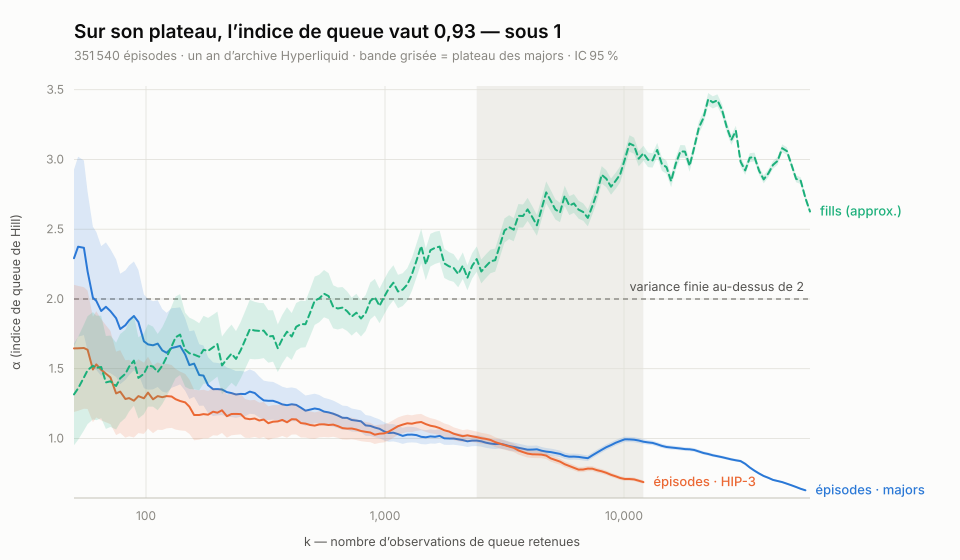

# hyperliquid-microstructure

Empirical microstructure research on **on-chain perpetual futures**, using
[Hyperliquid](https://hyperliquid.xyz) as the substrate.

The premise: most quantitative-finance work is benchmarked on synthetic processes, daily equity
closes, or private data. Hyperliquid publishes a derivatives market that is **fully public,
tick-resolved, and — for liquidations — named**, with no data licence between you and it. The
interesting questions here are the ones nobody else has the data to ask.

**→ [`experiments/FINDINGS.md`](experiments/FINDINGS.md) is the state of claims:** what holds,
what has been withdrawn and why, what is open. Read it before any individual experiment file.

---

## What has been established

### Hyperliquid follows the CEX market by ~550 ms

Binance leads Hyperliquid by a median **575 ms** on BTC — in **100% of 144 measured hours**, and
in 100% of 576 asset-hours across BTC, ETH, SOL and HYPE. The same estimator returns **25 ms**
between OKX and Binance, a factor of 23.

It survives volatility regimes, trade sparsity, liquidation cascades, and every asset the tape
covers. The CEX do not lead one another, which is what makes this Hyperliquid's property rather
than Binance's. Measured with a grid-free Hayashi-Yoshida estimator validated to zero error
against known lags.

**Open:** how much is mechanical (block cadence, network latency) versus genuine price
discovery. Trade sparsity is ruled out as the explanation; nothing has replaced it.

### Counting liquidation fills misrepresents liquidations

Hyperliquid's node-fills archive is the only public record of liquidations that is complete
*and* names the liquidated account, with its position size and realised loss. Counting **fills**
rather than liquidation episodes inflates event counts **5.72×** over an unbiased archive year,
and the inflation grows with size: a typical liquidation is 2 fills, the largest are 41.

It also compresses the size distribution — 3.4× at p99, 10.9× at p99.9 — so the largest single
liquidation ($3.84M) appears as fills of at most $899k.

The tail is genuinely heavy (exponential is rejected decisively) but **not a power law**:
lognormal and Weibull both beat Pareto and tie with each other. Earlier versions of this work
quoted a tail index; that claim is withdrawn, and FINDINGS.md explains why.



---

## How the work is done

This is the part worth copying, and it is why the results above are stated as narrowly as they
are.

- **Every experiment is pre-registered** — hypothesis and falsification criterion written into
  `experiments/EXP-NNN-*.md` *before* it runs. Several were committed while the campaign was
  still collecting, so the timestamps are checkable.
- **Retractions stay in the open.** Thirteen claims have been withdrawn or requalified; each
  correction sits in the file that made the original claim, with the reason. Nothing is
  rewritten to have always been right.
- **Estimators are validated against known answers before use.** This caught a sign inversion in
  the lead-lag estimator that would have read as "Hyperliquid leads" with perfect confidence,
  and a tail-index estimator that silently returned 0.00.
- **Campaigns are reproducible**: every reduced dataset is versioned in `experiments/data/`, so a
  result can be checked without re-running the collection.

### Method rules, each paid for by a real error

1. Test the boring confound first.
2. Read R² before t — in a large panel the p-value measures sample size.
3. An implausible `n` means the bug is upstream of the filter.
4. A caveat listed is not a confound controlled.
5. Validate an estimator against a known answer, sign included.
6. Check what a grouping key means before grouping by it.
7. Look at the values under a summary statistic.
8. A fit on its constraint boundary is not a result.

---

## Instruments

| | what it does |
|---|---|
| `hlm/data/archive.py` | streams the S3 `asset_ctxs` archive — whole perp universe, **minute grain, back to 2023-05-20** — and folds it to hourly Parquet. 8.7 GB compressed becomes 344 MB; nothing lands on disk raw. |
| `hlm/data/recorder.py` | live capture of `activeAssetCtx` only — funding, premium, impact prices, open interest. Deliberately narrow: `perplog-recorder` already covers trades and books multi-venue, and duplicating it would be worse data. |
| `hlm/data/hl_client.py` | `POST /info` with real weight accounting (`l2Book` costs 2, most info requests 20, paginated endpoints bill per item returned). |
| `hlm/analysis/leadlag.py` | Hayashi-Yoshida lead-lag for asynchronously observed prices. No grid, τ in milliseconds, validated to zero error. |
| `tools/pfr-dump` | decodes perplog's `.pfr` tape to CSV — see [`tools/README.md`](tools/README.md). |

`hlm/{problems,solvers,montecarlo,bench,strategy}/` are **empty placeholders** for the direction
below. They contain nothing yet, and the README says so rather than implying otherwise.

## Setup

```bash
python3 -m venv .venv
.venv/bin/pip install -e ".[dev]"
cp .env.example .env
```

No credentials are needed to reproduce anything above — the archive is requester-pays (AWS
credentials), and everything else is public. `.env` is only for testnet execution and IBM
Quantum, neither of which the current work uses.

## Two warnings for anyone using this data

**`mark_px` is mechanically entangled with `oracle_px`.** The mark formula includes
`oracle + EMA_150s(mid − oracle)`, so `ln(mark) − ln(oracle)` mean-reverts by definition, not by
arbitrage. Combining them measures the formula rather than the market — it produced a spurious
R² = 0.14 here before being caught ([EXP-004](experiments/EXP-004-oracle-perp-lead-lag.md)).
**Use `mid_px` for price dynamics.**

**Published datasets carry a derived account id, not the address** (`hlm/data/anon.py`).
Addresses are public on-chain, so this is not confidentiality — it avoids publishing a
*compiled* map of 350k accounts to their losses. Every number reproduces bit for bit on the
derived ids. The hash is unsalted and deterministic, so a known address can still be tested for
membership: **do not call these datasets anonymised.**

## Relationship to perplog

[`perplog`](https://perplog.com) operates the market-data infrastructure this research consumes:
`perplog-recorder` (Rust, 24/7, multi-venue tape → R2), `crates/archive` (SigV4 + lz4 for the HL
S3 archive), and `crates/backtest`, whose validation discipline — precommitted baselines,
fail-closed evidence, no selectively complete subsets — this repo mirrors rather than reinvents.

Multi-venue coverage is not a convenience: liquidation cascades propagate across venues, so an
HL-only capture would be strictly worse.

## Direction: quantum and quantum-inspired methods

Declared, **not started**. The repo is named for what it studies, not for a method it might use,
because a year of that method producing nothing should not leave a misleading name behind.

Two problems here are genuinely quantum-shaped, and both are microstructure questions with a
quantum solver rather than the reverse:

- **Selection under an action budget.** Hyperliquid meters actions against traded volume — 1
  action per 1 USDC cumulative — making rebalancing a hard-bounded resource with no equivalent
  in traditional finance. Multi-period selection under that constraint is a QUBO.
  ([EXP-001](experiments/EXP-001-action-budget.md), pre-registered, not run.)
- **Tail risk of liquidation cascades.** Quantum amplitude estimation offers a payoff-agnostic
  quadratic speedup, so its relative value is greatest where classical Monte Carlo struggles.
  The honest deliverable is a resource estimate — *when* would this matter — not a claimed
  speedup.

The state of the field is that no quantum advantage has been demonstrated for portfolio
optimisation ([arXiv:2509.17876](https://arxiv.org/pdf/2509.17876)), and quantum ML loses to
tree ensembles on DeFi data ([arXiv:2508.02685](https://www.arxiv.org/pdf/2508.02685)) — which
is why quantum-kernel prediction is out of scope. What published work in this area lacks is not
cleverness but tuned classical baselines, sealed holdouts, and pre-registration. That gap is the
opening, and it is the same discipline this repo already applies.
